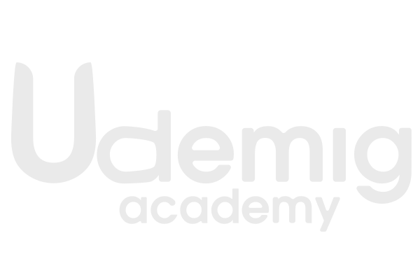
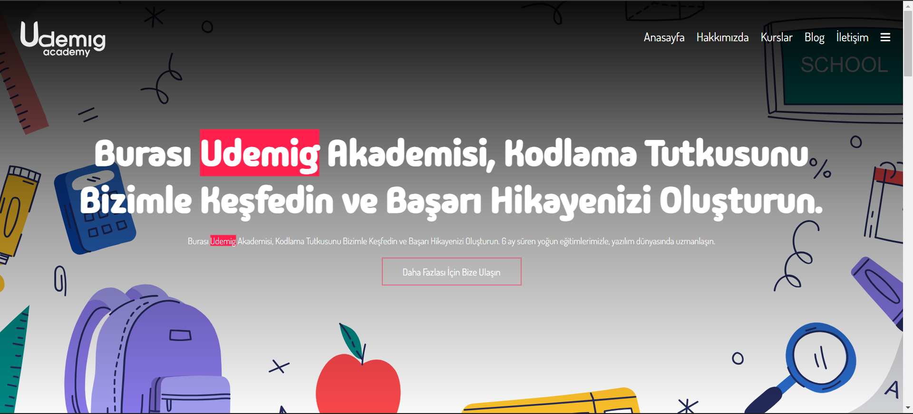
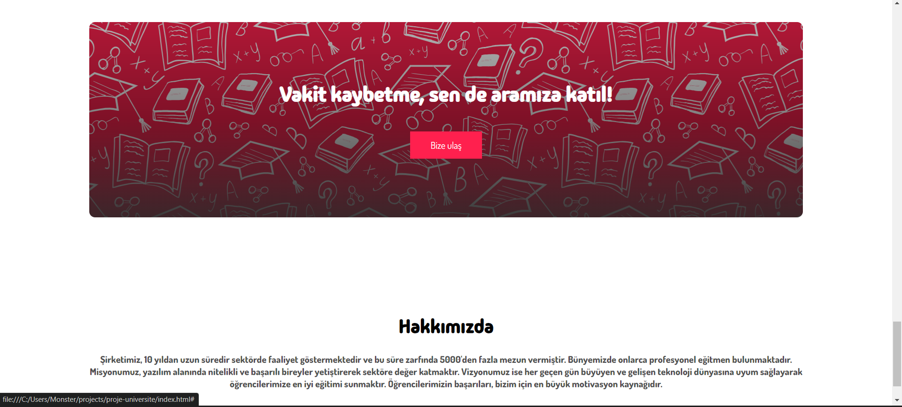
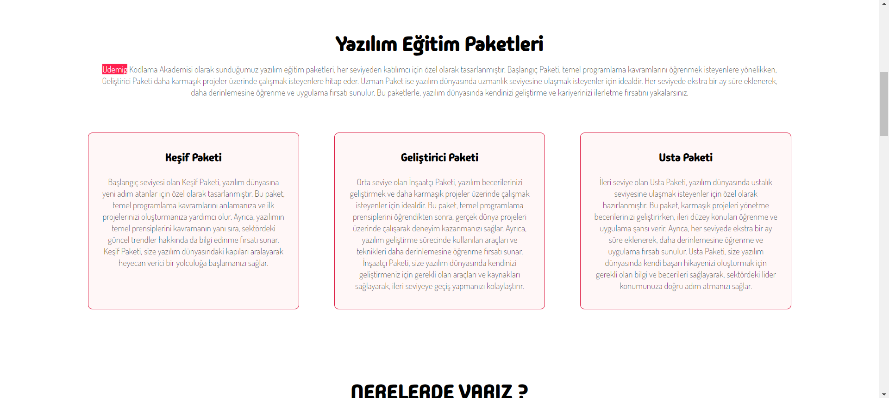
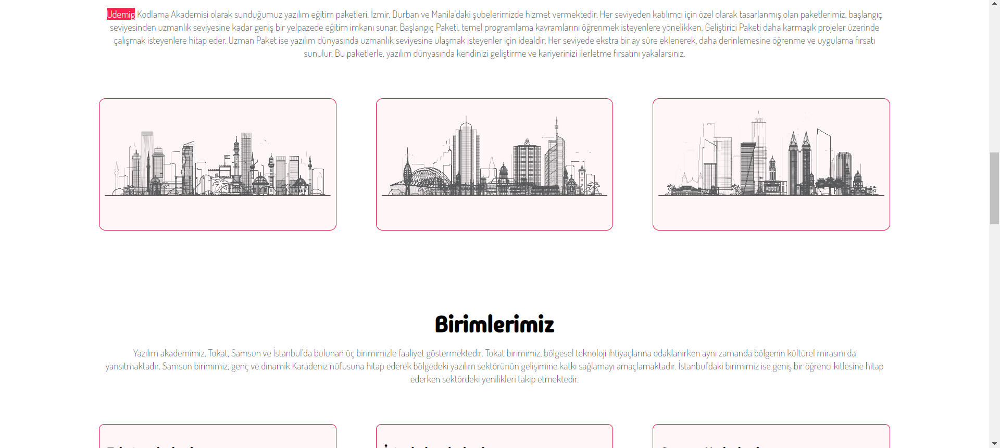
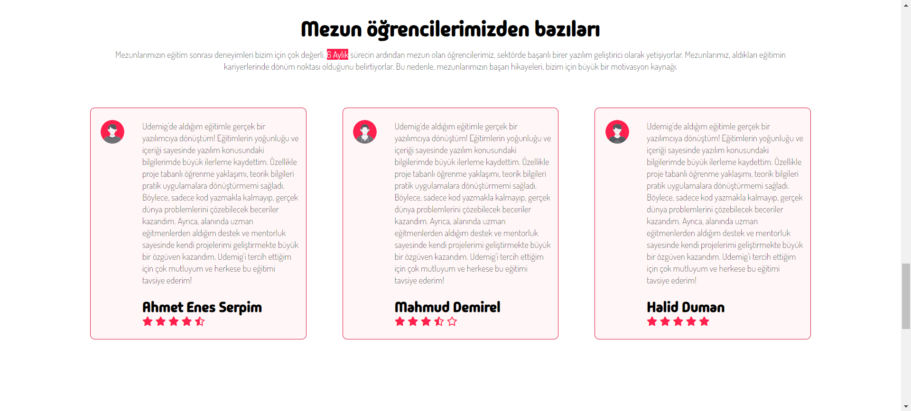

# Udemig Academy

Udemig Academy web sitesi projesi, yazılım eğitimi alanında faaliyet gösteren bir kurumun web sitesi için tasarlanmıştır. Proje kapsamında kırmızı tonlarında renkler tercih edilmiş ve görsel uyum ön planda tutulmuştur. Logo da projenin görsel kimliğine uygun olarak özel olarak tasarlanmıştır.

### Yukarıda yazılan metin gerçeği yansıtmamaktadır; bu bir proje ödevidir.

## Ekran Görüntüleri

1. Anasayfa
   

2. Hakkımızda Sayfası
   

3. Eğitim Paketleri Sayfası
   

4. Blog
   

5. SSS Sayfası
   

## Kullanılan Teknolojiler

- HTML
- CSS
# Akademi-projesi
